# Attendance Monitoring System

## Thesis Title: Development of Attendance Tracker System using computer vision based AI on an embedded system.

This project is a work of a bachelor thesis done by me as a student of Mechatronic Systems Engineering B.Sc.

     


 

## Table of Contents
1. [Abstract](#abstract)
2. [Fields Involved](#fields-involved)
3. [AI Models Used](#ai-models-used)
4. [Hardware Requirements and Circuit Diagram](#hardware-requirements-and-circuit-diagram)
5. [GUI](#gui)
6. [Optimisation Results](#optimisation-results)
7. [Results](#results)
8. [List of Dependencies and Steps of Code Execution](#list-of-dependencies-and-steps-of-code-execution)
9. [Conclusion](#conclusion)
10. [Contributors](#contributors)

## Abstract

<p align= "justify">
The scope of this thesis presents the development of an attendance tracker system from scratch using computer vision based AI deployed on an embedded system. As students frequently forget to fill out the user attendance list and the carbon footprints need to be physically stored for records, conventional techniques of attendance monitoring such as signing attendance sheets or calling out names of each student by the professor are becoming woefully out of date, repetitive, and dull. This is where the project comes into play. It aims to automate the entire system by implementing a quicker and more secure method of recording attendance that uses face recognition to authenticate the user and gesture recognition to identify the time of entry and exit of the lab, which are alluded to as login and logout. The face recognition has been implemented using the face-recognition python library whereas the hand detection and gesture recognition has been implemented using the MediaPipe library. The system has been meticulously packaged into a complete software that includes an interactive graphical user interface supporting all the key functionalities aside from user login, including: registering a new user in the database, deleting the user from the database, and changing other crucial system parameters from system preferences. This has been done to facilitate and mesmerize user experience. Python has been used only in the writing and development of the software because the goal of this thesis is to create a quick prototype. The finished product has a touchscreen, camera, and Raspberry Pi 4 inside a Polylactic Acid (PLA) case that was 3D printed, making it portable, lightweight, and simple to assemble.
</p>

## Fields Involved
- Computer Vision
- Artificial Intelligence
- Embedded Systems
- Programming
  - Completely developed on python
## AI Models Used
- Face Detection
- Face Recognition
- Hand Tracking and Hand Gesture Regonition
  - Palm Detection
  - Hand Landmark Detection

## Hardware Requirements and Circuit Diagram

- Raspberry Pi 4B
- Raspberry Pi Camera v1.3
- Raspberry Pi Touchscreen
- Power Adapter
- SD Card
- 3D printed casing

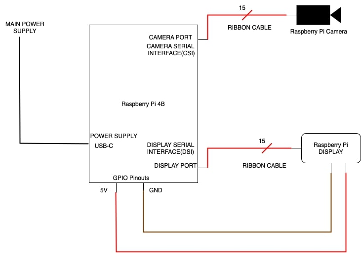

## GUI

### GUI Layout
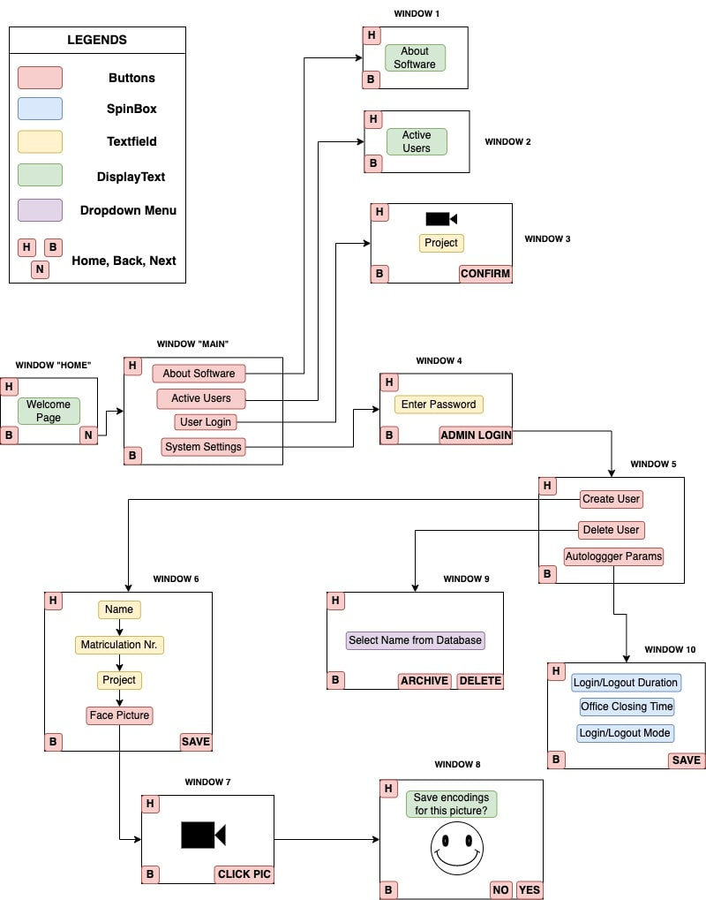

### GUI 
The graphical user interface has been built using a library called Tkinter. The following images showcase all the 12 windows present in the software.

|Welcome Window|Main Window|
|---|---|
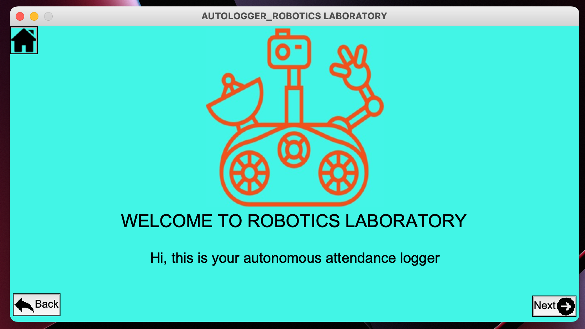 |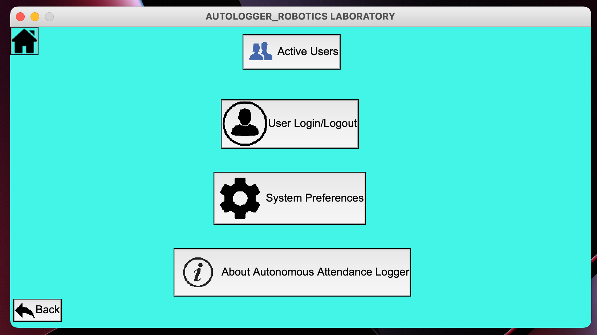|
|About Software Window|User Login Window|
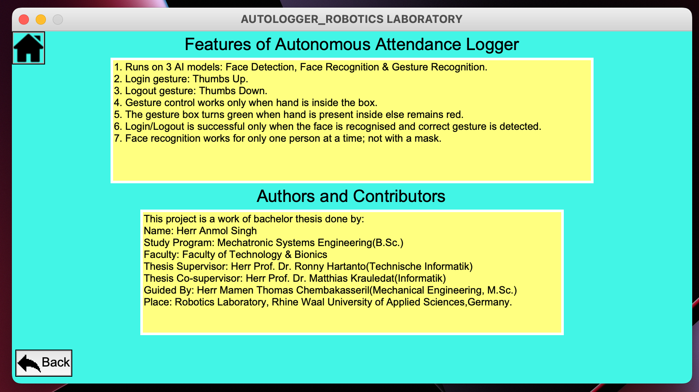 |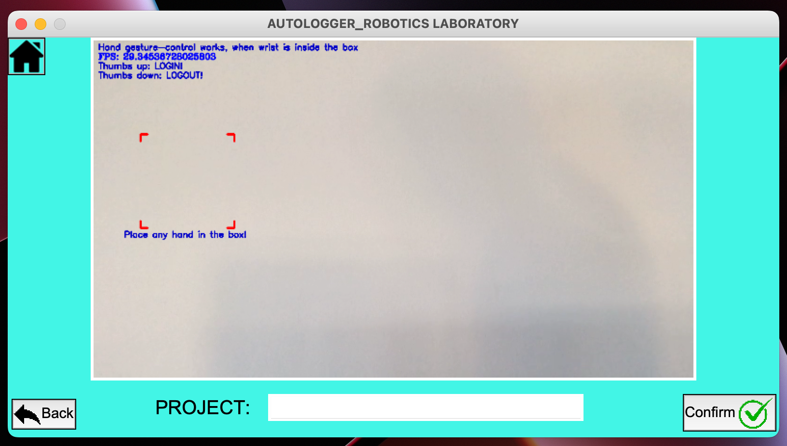|
|Active Users Window|Admin Password Window|
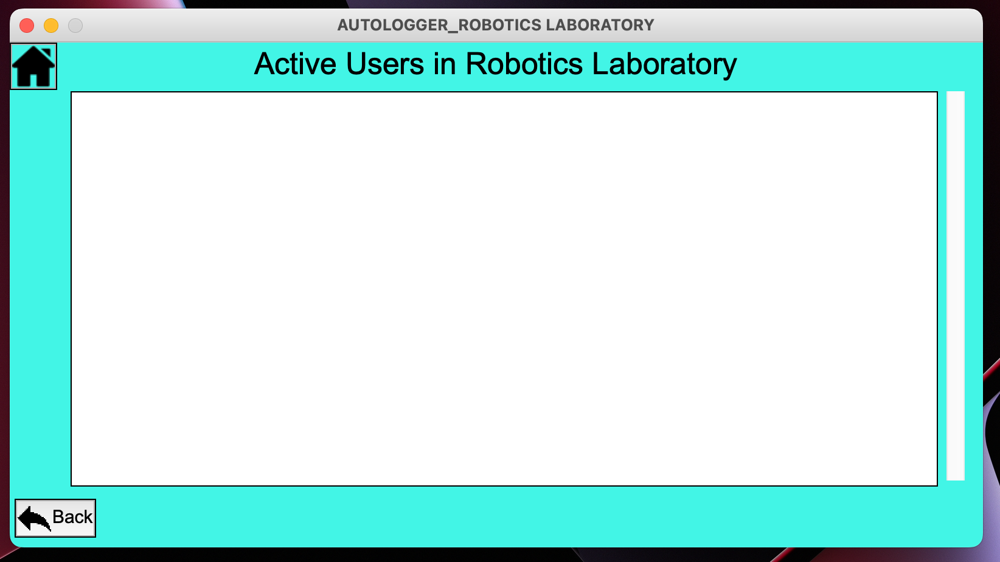 |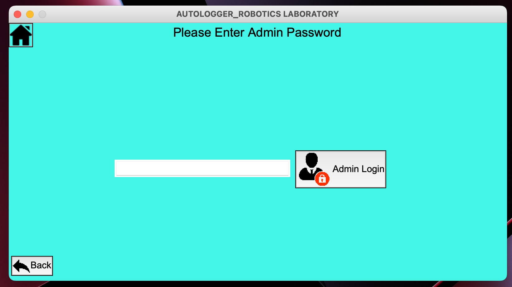|
|System Preferences Window|Create User(Registration form) Window|
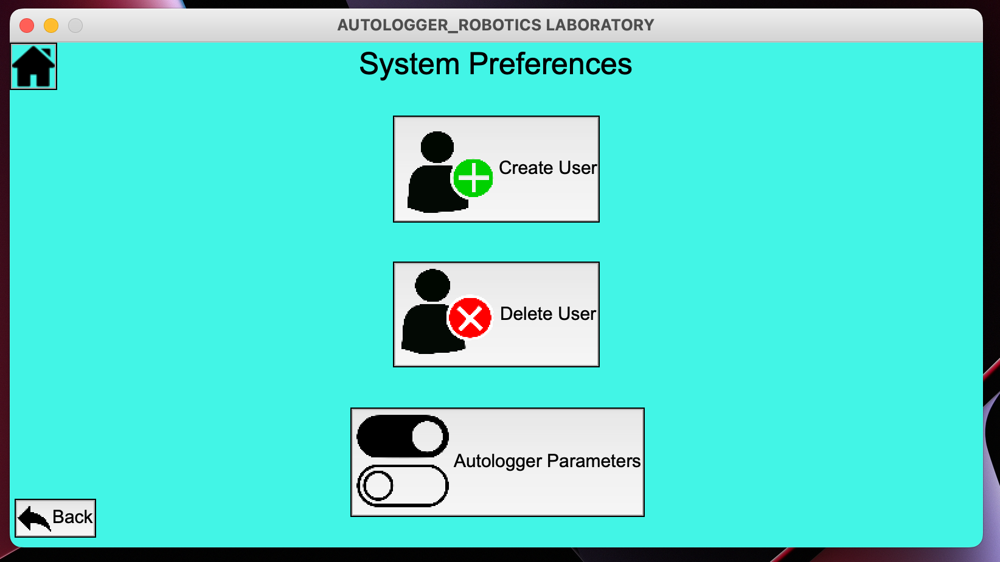 |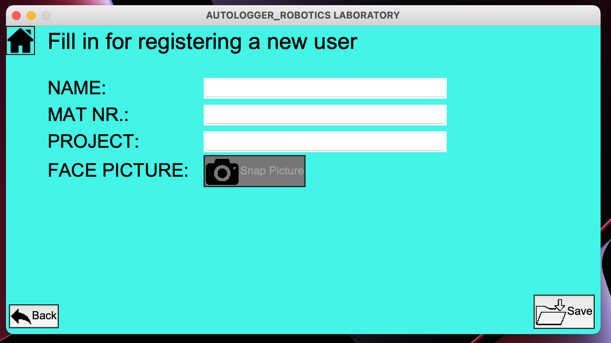|
|Create User(Snap Picture) Window|Create User(Confirmation) Window|
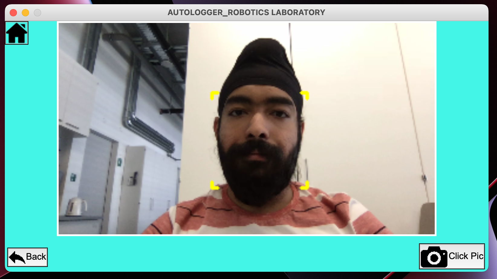 |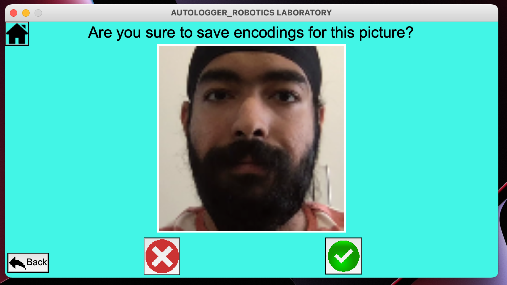|
|Delete/Archive User Window|Autologger Parameters Window|
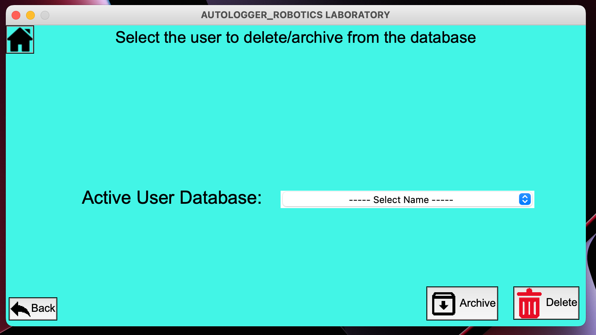 |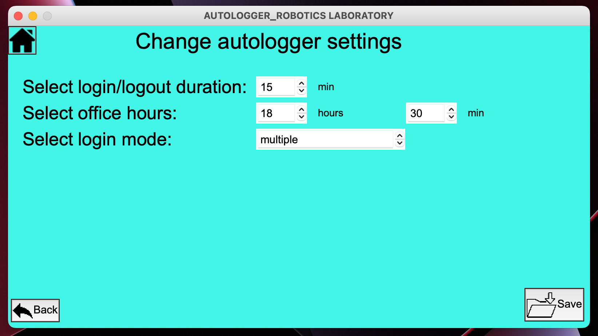|

## Optimisation Results
The optimization results have been carried out for 2 hardwares:
- Macbook Pro 15-inch, 2017 model
- Raspberry Pi model 4B (4GB)

Models used before optimisation:
- Face Detection and Recognition: face-recognition library.
- Hand Gesture Recognition: BlazePalm and BlazeHand from MediaPipe.

Models used after optimisation:
- Face detection: BlazeFace from Google implemented via MediaPipe
- Face Recognition: face-recognition library.
- Hand Gesture Recognition: BlazePalm and BlazeHand implemented via MediaPipe.

<!-- ### Performance Analysis Results and Time Analysis Results -->
<!-- 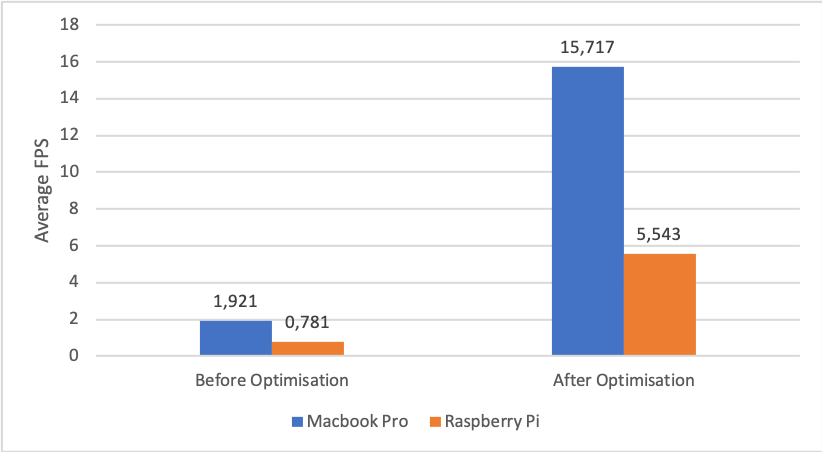 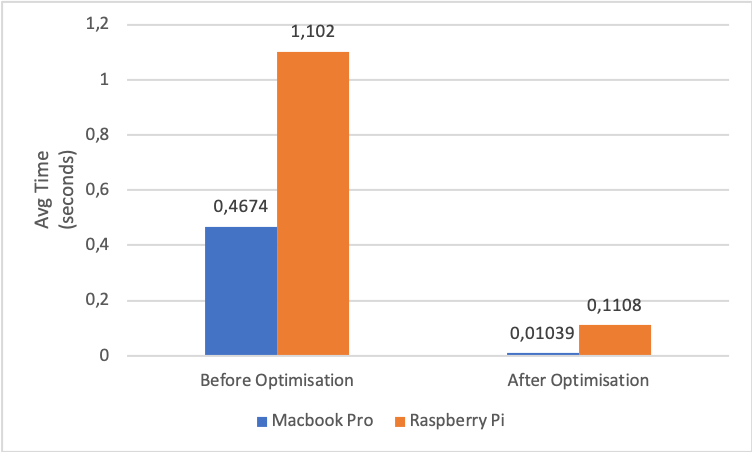 -->


|Performance Analysis Results|Time Analysis Results|
|---|---|
| ||

## Results
This section showcases some major functionalities of the software.

### User Login + Active Users
https://github.com/28anmol/Attendance-Tracking-System/raw/main/Results/media7.mov](https://user-images.githubusercontent.com/89078435/201904798-3550345b-c180-474a-a94c-3442776fee28.mov)
### User Logout + Active Users
https://user-images.githubusercontent.com/89078435/201905153-f43a71f0-e2b9-42f2-a377-65dc92d5b6db.mov
### Create User
https://user-images.githubusercontent.com/89078435/201905320-dbd46aca-d5d4-4ea6-9fc9-dd98e698edb7.mov
### Delete User
https://user-images.githubusercontent.com/89078435/201905450-ab40b47d-0fe4-4576-bfb4-ddc82632df20.mov
### Archive User
https://user-images.githubusercontent.com/89078435/201905528-04f72484-0399-4ad9-8e99-bf65edda8863.mov
### Autologger Parameters
https://user-images.githubusercontent.com/89078435/201905621-db8c1b8e-f049-4053-ad5e-b3f5d128021b.mov

## List of Dependencies and Steps Of Code Execution

To execute the code normally on a PC:
```bash
$ git clone https://robotics.hochschule-rhein-waal.de/gitlab/anmol280399/ attendance-tracker-system.git
```
```bash
$ cd attendance-tracker-system
```
```bash
$ sudo apt-get install python3-venv
```
```bash
$ python3 -m venv autolog
```
```bash
$ source autolog/bin/activate
```
```bash
$ python3 -m pip install --upgrade pip
```
```bash
$ pip install -r requirements.txt
```
```bash
$ python3 autologger.py
```

To execute the code through terminal on Raspberry Pi with the touchscreen and camera connected:
```bash
$ source autolog/bin/activate
```
```bash
$ export DISPLAY=:0.0
```
```bash
$ python3 autologger.py
```

## Conclusion

### Functional attendance tracker on embedded system

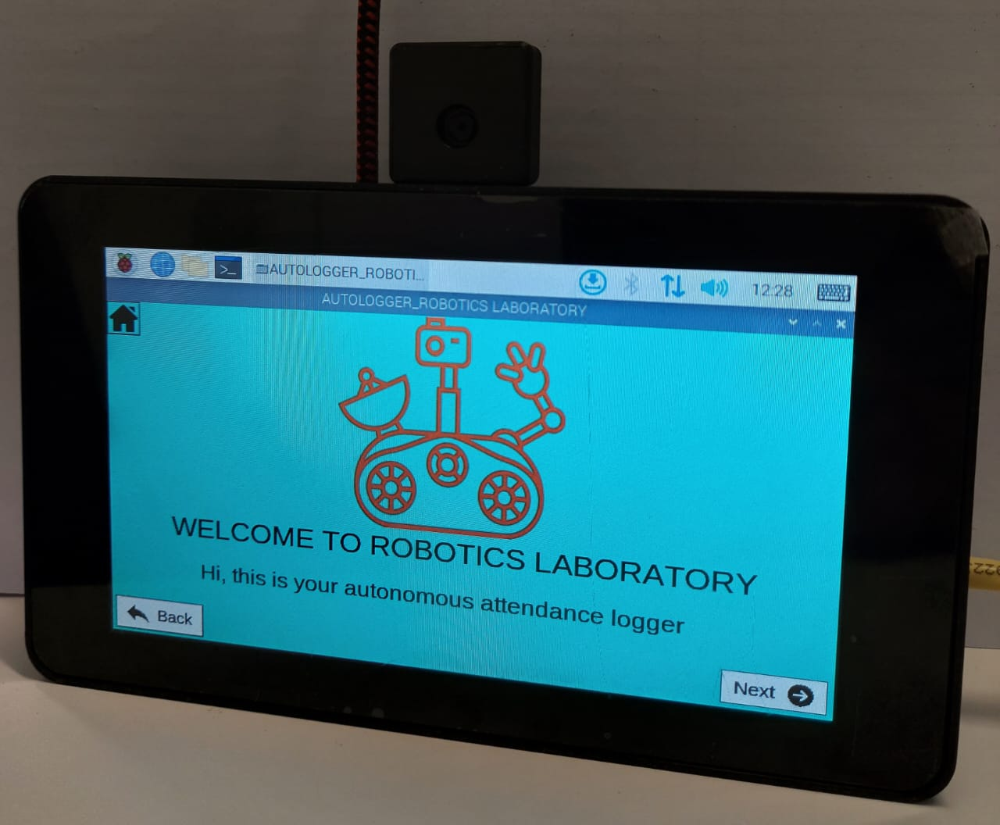

|Functionalities Delivered|
|---|
|User Login/Logout|
|Active Users|
|Create User|
|Delete/Archive User|
|Autologger Parameters|
|About Software|


## Contributors

**Author's Name**: Anmol Singh <br/>
**Matriculation Number:** 24244 <br/>
**Study Program:** Mechatronic Systems Engineering(B.Sc.) <br/>
**Study Semester:** 8th <br/>
**Degree Faculty:** Faculty of Technology & Bionics <br/>
**Bachelor Thesis Supervisor:** Prof. Dr. Ronny Hartanto(Technische Informatik) <br/>
**Bachelor Thesis Co-Supervisor:** Prof. Dr. Matthias Krauledat(Informatik) <br/>
**Guided & Supported by:** Mamen Thomas Chembakasseril(Mechanical Engineer, M.Sc.) <br/>
**Place:** Robotics Laboratory(05 EG 025), Rhine Waal University of Applied Sciences, Kleve, Germany. <br/>
